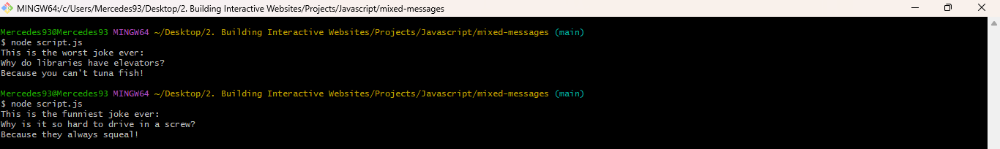

# **Mixed Messages**

## About

This is a Codecademy Portfolio Project. The purpose of this project is to generate a nonsensical joke, consisting of three randomised parts, each time the program is run. I was motivated to choose a joke theme for this project, as I thought it would be the most humorous.

## Features

The features of this project are:

+ Generate a random nonsensical joke
+ Display the joke to the user 

Below are some examples:

**Example 1:**

**Example 2:**

There are many combinations that can be generated. 

## How to Use

To use this project:

1. Install Node.js 
2. Install a CLI such as GitBash
3. Run the CLI e.g. GitBash
4. Navigate to the directory where the script is located
5. Enter the command *node script.js*

## Technologies

The technologies used are JavaScript, Node.js, and GitBash:

+ JavaScript is used to create the script
+ Node.js enables the script to be executed
+ GitBash is used to run the script
